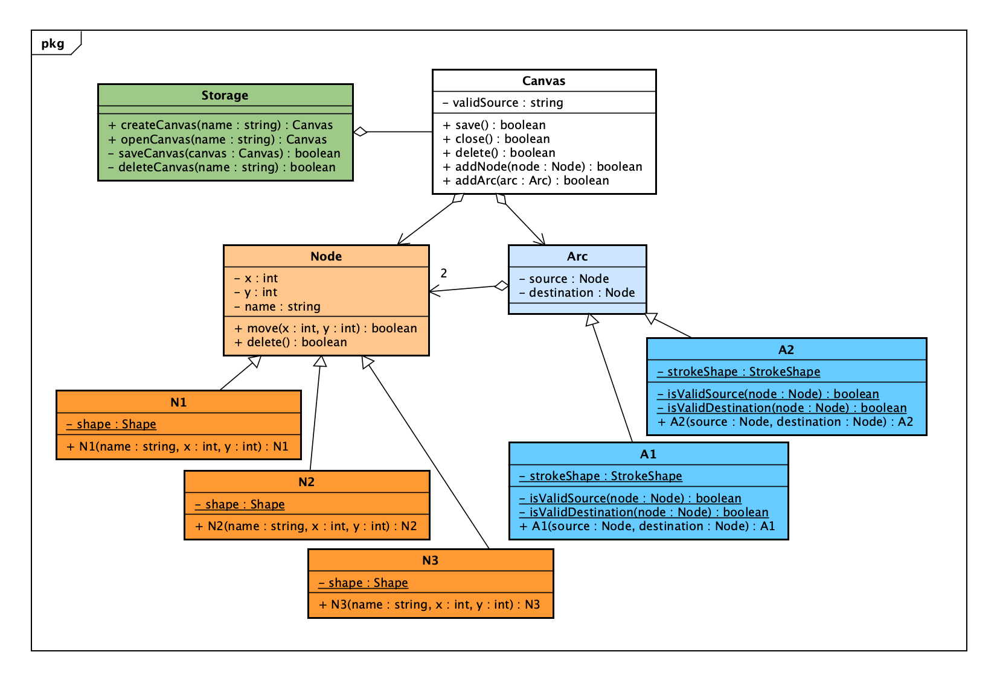

# Pirple
# Keeping Up With the Javascripts: ES6
## Homework Assignment #12: Object Oriented Programming
### filename: Readme.md
### author: Piero Corte
### date: 11 Dec 2020
————————————————————————————————————————————
### What is object oriented programming, and why would you use it? As you may already know, many javascript projects are written using a functional, or event-driven design pattern. In which cases would an OOP pattern be a better choice?
#

Object-Oriented Programming (OOP) is often the most natural and pragmatic approach to software development. Objects are used to represent real entities both in terms of their static characteristics, that is the information they are described with (data),  and in term of their behaviour, that is the way they act (methods).

Objects encapsulate their data and methods implementations. This aspect make OOP software very easy to modify. Each Object define a specific interface to interact with it and, as far as you modify its internal implementation without altering its interface, no other parts of the software need to be modified.

Each object has its own IDENTITY and it can be related to other objects. IDENTITY gives objects the ability to preserve their inter-relationships even when their internal state changes.

Objects can interact with each other through the exchange of messages (method invocations), according to their interfaces (protocols).

Other advantages of OOP reside on these other offered mechanisms:

* inheritance: objects can be defined starting (specializing) from others, forming a lattice of definitions. This way, more specific object can inherit both the interfaces and the implementations of the objects they specialize. This is beneficial for the code you need to write both in terms of dimension (quantity) and in term of their  organization;
* polymorphism: thanks to the inheritance mechanism, each object can result to be compliant to diffenter interfaces (i.e. has different forms), or if you want the same interface can be implemented by different objects with different implementations. This aspect gives the oop the ability to write "generic" code that operates on various types of objects, capable of exploiting the main capabilities of the various objects on which it operates, and more generally of knowing how to do it also on objects that will be defined later.

## Project: Drawing Graphs

### Description
My project is related to the design of a tool that enable a user to create canvases on which he can draw a graph consisting of various types of nodes and arcs. Specifically, the user can choose among three types of nodes and two types of arcs.
The source and destination of an arc are constrained, i.e. they can only be played by specified nodes.

### User Stories
A user want to:
* create new canvases, providing their names (when created, the canvas can be edited);
* save a canvas (when saved, all the editings are made persistent and the canvas continue to be edited);
* open a canvas (it open for editing a canvas previously saved and eventually close the current opened);
* close a canvas (it close the current opened canvas, if there are any unsaved changes, it asks for confirmation whether to save the changes or not);
* delete a canvas (it removes the canvas from persistent storage and closes it if currently open);
###
When editing the canvas, a user want to:
* add an instance of one of the three node types provided (the user must specify the position (x,y) and a name (label to show) of the node in the canvas, node types are differentated by a different shape, node instances by the label (unique name in the cavas namespace));
* move a node instance within the canvas to a different position (if the node has instances of arcs connected, these are appropriately redrawn);
* delete a node instance from the canvas (the node is cancelled and it it has instances of arcs connected, they are cancelled as well);
* connect two nodes within the canvas with an instance of one of the two types of arcs (this will succed only it the source and the destination nodes satisfy the arcs constraints)
* delete an arc instance from the canvas.
  
### UML Class Diagram



```
According to the previous diagram you can:
– create a new Canvas with the createCanvas method of a Storage object;
– instantiate only nodes of class N1, N2 and N3 (not of class Node)
– instantiate only arcs of class A1 and A2 (not of class Arc)
– when instantiate an arc, a source and  a destination node are required. The constructor
verifies if these nodes are valid as source and destination and if not it fails.

```
